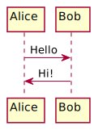

Regular **Markdown** here.

<!--
@startuml firstDiagram

Alice -> Bob: Hello
Bob -> Alice: Hi!
		
@enduml
-->

<!--
@startuml secondDiagram
DataAccess - [First Component]
[First Component] ..> HTTP : use
@enduml
-->

Some more markdown.
Yo dude this worked.
